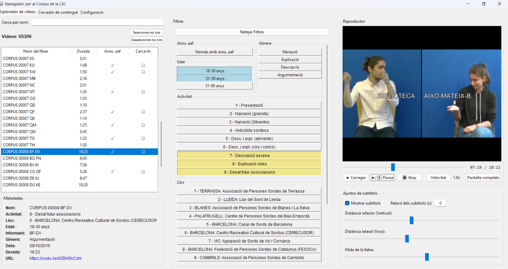
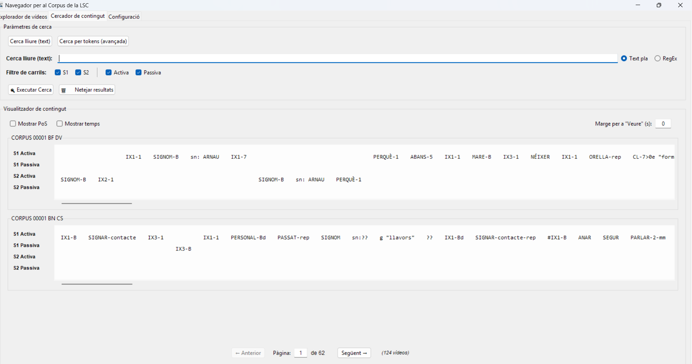
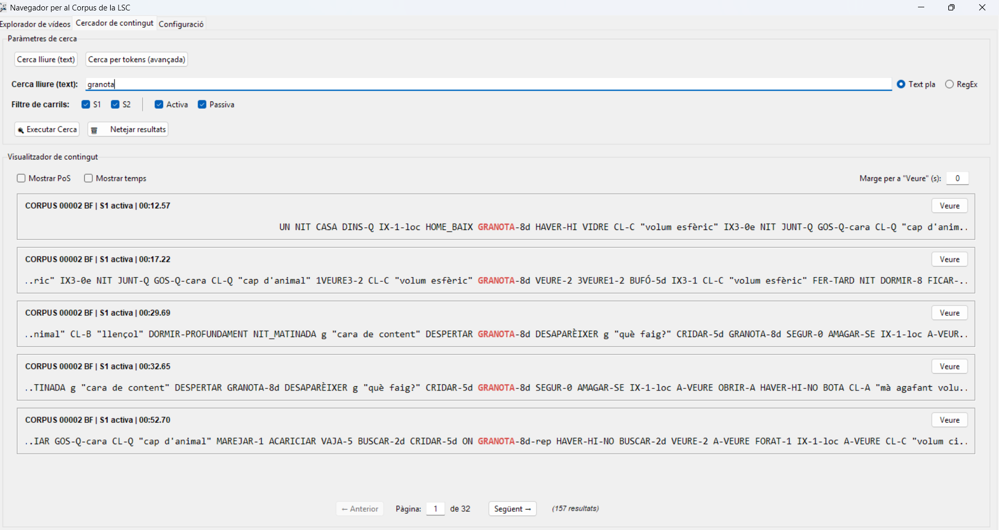

# Navegador per al corpus de la LSC
Aquest programa serveix per consultar el [corpus de la llengua de signes catalana (LSC)](https://corpuslsc.iec.cat/) de l'Institut d'Estudis Catalans (IEC) d'una manera centralitzada i eficaç. Actualment serveix tant per veure'n els enregistraments com per buscar a les anotacions dels fitxers EAF.

## Índex
* [Engegar el programa](#engegar-el-programa)
    * [Descarregar els fitxers](#descarregar-els-fitxers)
    * [Fitxer "mpd-1.dll"](#fitxer-mpd-1dll)
    * [Fitxers EAF](#fitxers-eaf)
    * [Obrir el programa](#obrir-el-programa)
* [Un cop dins del programa](#un-cop-dins-del-programa)
    * [Explorador de vídeos](#explorador-de-vídeos)
    * [Cercador de contingut](#cercador-de-contingut)
    * [Configuració](#configuració)
* [Contacte](#contacte)

---

## Engegar el programa

### Descarregar els fitxers
Per executar el navegador cal tenir Windows com a sistema operatiu. A més, caldrà que us descarregueu el fitxer "V1.0_navegador_corpus_LSC.zip". És un arxiu comprimit, o sigui que caldrà que el descomprimiu (si teniu dubtes sobr això, mireu la secció següent). Abans de continuar, comproveu que hi teniu com a mínim aquests arxius:
- ELAN *[subcarpeta]*
- Subtitles *[subcarpeta]*
- ELAN_temporary *[subcarpeta]*
- config.json
- durada.csv
- metadades_videos.csv
- navegador_corpus_LSC.exe

### Fitxer "mpd-1.dll"
A continuació caldrà que aconseguiu un fitxer necessari per a la reproducció dels vídeos. Aneu a la [pàgina de descàrregues de MPV](https://mpv.io/installation/) i seleccioneu un dels primers enllaços ("Windows builds by [...]"). En aquesta pàgina busqueu l'arxiu que comenci per "mpv-dev-x86_64-v3-" i descarregueu-lo. Per obrir-lo necessitareu un gestor de fitxers comprimits ([7zip](https://www.7-zip.org/) per exemple). A dins del comprimit hi trobareu un fitxer anomenat "libmpv-2.dll". Moveu-lo a la carpeta on teniu la resta de fitxers i reanomeneu-lo "mpv-1.dll".

### Fitxers EAF
Si voleu fer servir les anotacions EAF (els fitxers que llegeix el [programa ELAN](https://archive.mpi.nl/tla/elan)) cal que les descarregueu de la pàgina de l'IEC. Aneu a [aquest enllaç](https://corpuslsc.iec.cat/area-de-descarrega/), entreu a les carpetes de Drive dels grups d'edat/activitats que vulgueu i descarregueu-ne els arxius EAF. Pot ser que no hi siguin tots, perquè alguns estan pendents de revisió. La mateixa pàgina explica com demanar accés a la resta de fitxers. En tot cas, no són necessaris per a fer servir el programa.

Un cop els tingueu, poseu-los a la subcarpeta "ELAN" dins de la carpeta amb els arxius que heu descarregat d'aquest repositori (on teniu l'EXE i els dos fitxers CSV). **No poseu res a la carpeta "ELAN_temporary":** podríeu perdre el que hi poseu. A més, per segurat, us recomano guardar una còpia dels arxius EAF "lluny" dels fitxers del programa.

### Obrir el programa
Un cop tingueu hagueu descarregat tots els materials i els tingueu a lloc, només cal que feu doble clic a "navegador_corpus_LSC.exe". El programa s'obrirà en la seva pròpia finestra.

---

## Un cop dins del programa
El navegador té tres pestanyes, que podeu seleccionar a la part de dalt a l'esquerra de la finestra. La primera serveix per veure els enregistraments del corpus; la segona, per cercar text a les glosses i la tercera serveix per activar el mode fosc i veure arxius EAF desemparellats. A continuació podeu trobar instruccions per a cadascuna de les pestanyes.

### Explorador de vídeos

L'explorador es divideix en tres columnes. A l'esquerra hi ha una llista amb tots els vídeos del corpus. Mostra el nom, la durada i si s'ha detectat l'arxiu EAF corresponent a la carpeta "ELAN". La columneta "Cerca-hi" s'explica a l'apartat del cercador. Si seleccioneu un vídeo fent-hi clic veureu que el requadre de sota titolat "Metadades" s'omple amb la informació del vídeo. També veureu que es carrega una previsualització al reproductor de la dreta. A sobre la llista hi ha també una caixa de text per buscar vídeos pel nom.

La segona columna permet filtrar els vídeos segons diversos paràmetres. Són acumulatius, de manera que si podem seleccionar les activitats 1 i 2 i es mostraran els vídeos de les dues. Els filtres que apliqueu modificaran quins vídeos veieu a la llista de l'esquerra. El comptador "Vídeos: X/328" us dirà quants vídeos compleixen els requisits dels filtres. Si voleu eliminar els filtres, per no haver-los de tornar a clicar un per un, podeu fer servir el botó "Netejar filtres", que els desmarcarà tots.

A la dreta de tot hi ha el reproductor de vídeos. A la part de dalt hi ha la "pantalla" en què apareixerà la previsualització del vídeo quan la seleccioneu. Si premeu el botó "Carregar", començarà el vídeo (pot ser que trigui uns segons). Un cop comenci a reproduir-se, podeu pausar-lo, aturar-lo o modificar-ne la velocitat (feu clic per anar rotant entre les diverses opcions). També podeu veure el reproductor en pantalla completa amb el botó de la dreta. 

Si teniu l'arxiu EAF que correspon al vídeo seleccionat, podreu veure les anotacions/glosses en forma de subtítols durant la visualització. Podeu desactivar-los o ajustar-los amb les opcions de sota del reproductor. Per modificar-ne la posició podeu fer servir els dos primers lliscadors i la mida de la lletra la podeu canviar amb el tercer. A banda, si trobéssiu que el vídeo i els subtítols no estan sincronitzats, podeu avançar o endarrerir els subtítols l'opció corresponent.

### Cercador de contingut

Si anem a la segona pestanya tot just obrir el programa, veurem que hi apareix el text "Selecciona vídeos a l'explorador per començar". Per fer servir les funcionalitats del cercador, cal indicar en quins vídeos volem buscar. Com que es fan servir els arxius EAF i no els enregistraments, cal que tingueu les anotacions dels vídeos que us interessin a la carpeta ELAN.

Per seleccionar-los, doncs, cal tornar a la primera pestanya i a la llista de vídeos fer servir la columna "Cerca-hi" per marcar les caixetes. Per no haver de fer-ho manualment podeu fer servir el botó "Seleccionar-los tots" que hi ha just a sobre. Tant aquest botó com el que deseleccionar actuen sobre els vídeos que mostra la llista en aquell moment, de manera que podeu combinar-los amb els filtres.

Un cop tingueu els vídeos triats, si torneu al cercador veureu que ara hi apareixeran unes caixes de text amb diverses línies. A cada vídeo seleccionat li'n correspon una (el titolet de la caixeta indica quin vídeo és) i s'hi mostra el contingut de l'arxiu ELAN. Cada línia correspon a una mà de cadascun dels dos signants. cal tenir en compte que els espais entre signes no és relatiu, és a dir, que dos signes més distants en el temps tenen el mateix espai entremig que dos de molt propers.

Podeu fer servir la barra horitzontal de cada caixeta per veure totes les anotacions. Si voleu veure la marca de temps de cada signe podeu prémer el botó "Mostrar temps". El botó "Mostrar PoS" (de *Part of Speech*, 'categoria gramatical' en anglès) actualment mostra "XXX" per a tots els signes: és una funcionalitat no implementada. Per veure la resta de caixetes, heu de servir els controls de la part de baix. Podeu avançar les pàgines manualment o escriure al requadre la pàgina a què voleu saltar.

Per fer servir la cerca pròpiament, cal que anem a la part de dalt de la finestra. Hi trobareu dos botons: "Cerca lliure (text)" i "Cerca per tokens (avançada)". Actualment, només està implementada la primera, que és la que està seleccionada per defecte. Veureu, doncs, que hi ha una caixeta de text en què podeu escriure. Si premeu la tecla Intro, s'executarà la cerca. Podeu també seleccionar en quin dels "carrils" de les anotacions voleu buscar, és a dir, quina mà de quin signant. 

Si sabeu fer servir expressions regulars (ER o RegEx), a la dreta de la caixeta podeu canviar el cercador per poder-n'hi introduir. En tot cas, el cercador no distingeix mai entre majúscules i minúscules. També, si després de la cerca voleu tornar a veure les caixetes de text amb tot el fitxer d'anotacions, podeu fer servir el botó "Netejar resultats".

Quan hagueu fet una cerca veureu que el visualitzador de contingut canvia. En lloc d'aparèixer-hi les anotacions amb quatre línies per a cada vídeo hi podeu veure una caixeta per a cada resultat de cerca. Només es mostra la línia en què s'ha trobat (signant i mà), amb la coincidència al centre en negreta i de color vermell. A banda i banda podeu veure'n el context. Si el context no arriba a la vora de la pantalla és perquè la coincidència és al principi o al final del vídeo. Per navegar entre resultats, podeu fer servir els controls de sota.

A la dreta de cada resultat hi ha botó "Veure". Si el premeu, el programa us portarà automàticament a la pestanya de l'explorador de vídeos i carregarà el vídeo al segon en què comença el resultat de la cerca. Si no voleu que comenci just aleshores, sinó que preferiu tenir uns segons de marge, podeu fer servir la caixeta de text "Marge per a 'Veure' (s)" per indicar quants segons abans de la coincidència voleu a l'hora de veure el resultat en el vídeo.

### Configuració
En la tercera pestanya podeu activar el mode fosc, que pot ser que no vagi del tot bé. També podeu veure quins arxius EAF ha detectat el programa que no es corresponen amb cap vídeo. El programa ja fa molta feina invisible de normalització noms de vídeo i de fitxers, però en algus casos no és suficient. Si veieu que hi ha força arxius que no es detecten correctament, o justament un arxiu que voleu consultar sí o sí no es detecta, aviseu-me.

---

## Contacte
Si teniu cap dubte o suggeriment de millora, si us plau no dubteu a contactar-me. També em podeu demanar els arxius de codi del programa si els voleu veure. La meva adreça de correu electrònic és aquesta: eloi [punt] singla [arroba] upf [punt] edu

Les millores que m'agradaria fer en algun moment de cara a una versió 2.0 són aquests:
- Poder guardar i carregar combinacions de filtres
- Poder generar i carregar arxius CSV amb els resultats de cerca
- Anotacions PoS (categoria gramatical) a partir de les glosses
- Cerca avançada per "tokens"
